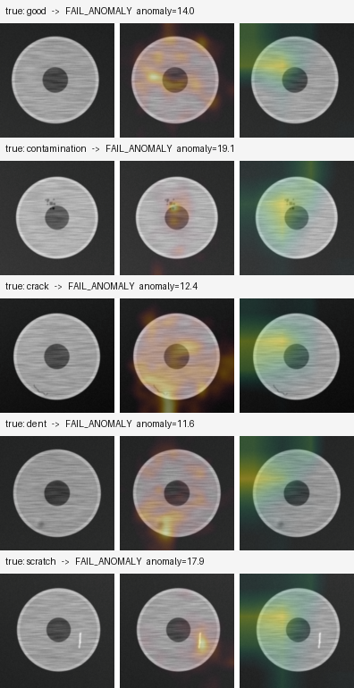

# VisionQC — Automated Visual Quality Inspection

**Dual-path defect detection for manufacturing: a supervised CNN classifier for known defect types, plus a from-scratch PaDiM anomaly detector that catches defects nobody has ever labelled.**

<!--
  DEMO GIF GOES HERE — this is the single highest-value element of this README.
  Generate the static version with:
      PYTHONPATH=src python scripts/make_demo_assets.py --config configs/synthetic.yaml
  then record 10-15s of the /docs page for the GIF and drop it in as:
      
-->


*Left to right: the input part, the PaDiM anomaly heatmap, and the classifier's Grad-CAM attention.*

---

## The problem

Automated visual inspection sounds like a classification task. It isn't, and the reason is structural:

> **Defects are rare by definition.** A healthy production line barely produces any. So labelled defect examples are scarce and expensive, and new defect types keep appearing that no classifier was ever trained on.

A supervised classifier shown a defect type it has never seen doesn't say *"I'm unsure."* It confidently assigns it to the nearest class it knows — usually **"good"**. The part ships. You find out from a customer.

VisionQC is designed around that constraint rather than around a dataset.

---

## Architecture

```
                      ┌────────────────────┐
   Part image ───────▶│   Preprocessing    │
                      │  resize, normalise │
                      └─────────┬──────────┘
                                │
              ┌─────────────────┴──────────────────┐
              ▼                                    ▼
   ┌──────────────────────┐          ┌──────────────────────────┐
   │  SUPERVISED PATH     │          │   UNSUPERVISED PATH      │
   │  ResNet18 classifier │          │   PaDiM (from scratch)   │
   │  needs labelled      │          │   fitted on NORMAL parts │
   │  defects             │          │   only — zero labels     │
   └──────────┬───────────┘          └────────────┬─────────────┘
              │                                   │
              ▼                                   ▼
   ┌──────────────────────┐          ┌──────────────────────────┐
   │  Grad-CAM heatmap    │          │  Mahalanobis heatmap     │
   │  + defect class      │          │  + anomaly score         │
   └──────────┬───────────┘          └────────────┬─────────────┘
              │                                   │
              └───────────────┬───────────────────┘
                              ▼
                 ┌────────────────────────────┐
                 │      DECISION LAYER        │
                 │  cost-calibrated threshold │
                 │  PASS / FAIL / REVIEW      │
                 └─────────────┬──────────────┘
                               ▼
                 ┌────────────────────────────┐
                 │   FastAPI  ·  Docker       │
                 │   POST /inspect            │
                 └────────────────────────────┘
```

The two models fail in **largely uncorrelated ways**. The classifier is blind to unseen defect types; PaDiM can't name what it finds but flags any deviation from normal. Flagging when *either* fires catches strictly more than either alone.

---

## Results

> Fill this in from your own `artifacts/<run>/results.md`. Numbers below are placeholders.

**Dataset:** MVTec AD (`bottle`) · **Test split:** N images, held out and untouched until final evaluation

### Image-level detection

| Model | AUROC | AUPR | Recall | Precision | F1 | FN | FP |
|---|---|---|---|---|---|---|---|
| Classifier (supervised) | — | — | — | — | — | — | — |
| Autoencoder (baseline) | — | — | — | — | — | — | — |
| **PaDiM** | — | — | — | — | — | — | — |
| Fusion (OR) | n/a | n/a | — | — | — | — | — |

*Fusion has no AUROC by construction — it outputs a hard decision, not a rankable score.*

### Localisation (pixel level)

| Model | Pixel AUROC | Peak-hit rate | Mean IoU (top 1%) |
|---|---|---|---|
| PaDiM | — | — | — |

### Operating point & latency

- **Threshold:** chosen by minimising `10×FN + 1×FP` on validation — see [`cost_curve.png`](docs/)
- **Latency:** mean — ms, p95 — ms, CPU, batch size 1 (budget: < 2000 ms)

---

## What makes this different from a typical CV portfolio project

| Typical project | VisionQC |
|---|---|
| Assumes balanced, fully-labelled data | Built around **scarce, expensive defect labels** |
| One model | **Two models** with complementary blind spots |
| Reports accuracy | Reports **recall, precision, AUROC, AUPR** — and explains why accuracy misleads at 2% defect rate |
| `threshold = 0.5` | Threshold **derived from business cost**, with the curve to prove it |
| Black box | **Grad-CAM + anomaly heatmaps**, used for debugging as much as for users |
| Notebook | **Tested, containerised REST API** |
| No failure discussion | **Explicit error analysis** on the worst false negatives and false positives |
| `pip install anomalib` | **PaDiM implemented from scratch** — Mahalanobis, Cholesky solve, streaming covariance |

---

## Quickstart

```bash
git clone https://github.com/<you>/visionqc.git
cd visionqc

python3 -m venv .venv && source .venv/bin/activate
pip install -r requirements.txt
# CPU-only machine? Install torch from the CPU index first:
#   pip install torch torchvision --index-url https://download.pytorch.org/whl/cpu

make all        # generate data → split → fit PaDiM → train AE + classifier → evaluate
```

Open `artifacts/synthetic/results.md`.

**No dataset download required.** `make data` generates a synthetic MVTec-layout dataset — brushed-metal parts with four defect types and pixel-perfect masks — so the full pipeline runs in minutes. Swap in real data by changing one path.

### Serve it

```bash
make serve      # → http://localhost:8000/docs
```

```bash
curl -X POST http://localhost:8000/inspect \
     -F "file=@data/synthetic/test/scratch/000.png" | python -m json.tool
```

```json
{
  "decision": {
    "verdict": "FAIL_ANOMALY",
    "anomaly_score": 27.4,
    "anomaly_normalised": 2.2,
    "predicted_class": "good",
    "classifier_flag": false,
    "anomaly_flag": true,
    "reasons": [
      "classifier P(defect)=0.410 < threshold 0.717",
      "anomaly score=27.400 >= threshold 11.461",
      "deviation from normal with no matching known defect class"
    ]
  },
  "latency_ms": 118.3,
  "heatmap_png_base64": "iVBORw0KGgo..."
}
```

Every verdict carries its own reasoning. When an operator asks *"why was this pulled?"*, the answer is in the payload.

### Container

```bash
make docker && make docker-run
```

### Real datasets

```bash
# MVTec AD — one category at a time
python scripts/prepare_dataset.py mvtec --src ~/Downloads/mvtec_anomaly_detection/bottle \
                                        --dst data/mvtec/bottle
make all CONFIG=configs/mvtec_bottle.yaml RUN_DIR=artifacts/mvtec_bottle

# Kaggle casting product dataset
python scripts/prepare_dataset.py casting --src ~/Downloads/casting_data --dst data/casting
```

---

## Design decisions

**One test set, shared by both models.** The two paths have incompatible training needs — one requires normal-only data, the other requires labelled defects. Giving each its own split would make their numbers incomparable. Instead a stratified 50% of the labelled pool is frozen as holdout, and an assertion runs on **every** split build verifying it's disjoint from all training splits.

**The threshold is a business decision.** `0.5` is a convention from balanced classification, not a decision. VisionQC minimises `C_fn × FN + C_fp × FP` on validation, with the cost ratio as a config value. Change `10.0` to `50.0` and the operating point re-derives.

**Calibrate on validation, evaluate on test.** Sweeping thresholds on the test set and reporting the best is a real, subtle leak. `evaluate.py` enforces the two stages structurally and logs them separately.

**One inference path.** `InspectionEngine` owns preprocessing and scoring; both evaluation and the API call it. Neither has its own copy. This is the structural fix for training/serving skew.

**PaDiM from scratch.** ~120 lines: streaming covariance accumulation in float64, ridge regularisation scaled to average variance, Cholesky factorisation with a triangular solve instead of an explicit matrix inverse. `anomalib` would be the production choice; understanding the algorithm was the point here.

**Self-contained checkpoints.** PaDiM saves its backbone weights alongside the fitted Gaussians. Costs 45 MB, buys two things: the statistics can never be paired with a mismatched feature space, and the container needs no network at startup.

**No OpenCV.** Gaussian blur is a separable conv in torch; colour maps come from matplotlib. One fewer heavy C dependency — which matters more than usual right after OpenCV's 5.x major bump.

**Augmentation is domain-reasoned, not copy-pasted.** Rotation and brightness jitter, yes — parts arrive at arbitrary orientation under drifting factory lighting. Random erasing, **no**: it synthesises something visually identical to the contamination defect class. And PaDiM fits *without* augmentation, because rotation destroys the per-position distributions it depends on.

---

## Testing

```bash
pytest -q       # 57 tests, ~7 seconds
```

Tests target things that fail **silently**, because those are the ones that cost a week:

- Do defects leak into the anomaly training split?
- Does freezing actually freeze — including BatchNorm's running statistics?
- Does `save()` → `load()` reproduce bit-identical scores?
- Does the cost threshold actually favour recall as `C_fn` rises?
- Does a missing model produce `REVIEW` rather than a silent stream of `PASS`?

---

## Project structure

```
src/visionqc/
├── config.py           typed config, YAML, saved with every run
├── data/
│   ├── synthetic.py    MVTec-layout dataset generator
│   ├── splits.py     ⭐ leak-free split protocol
│   └── datasets.py     v2 transforms, class weights
├── models/
│   ├── classifier.py   ResNet18 + staged unfreezing
│   ├── autoencoder.py  conv AE baseline
│   └── padim.py      ⭐ PaDiM from scratch
├── explain/
│   ├── gradcam.py    ⭐ Grad-CAM from scratch (hooks)
│   └── overlay.py      heatmap rendering
├── metrics.py        ⭐ metrics + cost-based thresholds
├── decision.py       ⭐ scores → PASS/FAIL/REVIEW
├── inference.py      ⭐ shared engine (no training/serving skew)
└── api/main.py         FastAPI service
```

Every module opens with a docstring explaining **why it exists**, not just what it does.

---

## Limitations

Stated plainly, because hiding them is worse than having them.

1. **Synthetic data is easier than real data.** Use it to validate the pipeline; report MVTec numbers as the real result.
2. **PaDiM assumes aligned parts.** Per-position Gaussians degrade under arbitrary rotation. PatchCore handles that better.
3. **Grad-CAM is coarse** — 8×8 upsampled at 256px input. Good for regions, not pixels. The PaDiM map is the better localiser.
4. **The 10:1 cost ratio is a defensible placeholder**, not a measured business figure.
5. **Small test set** — confidence intervals on AUROC are wide and currently unreported.
6. **No drift monitoring.** A real deployment needs to detect when *normal itself* shifts.
7. **The supervised path is deliberately data-starved** (~10 labelled images per defect class). That's the honest reflection of the problem, and it's precisely the argument for the unsupervised path.

## Future work

- **PatchCore** — drops the alignment assumption, generally scores higher
- **Active learning** — `FAIL_ANOMALY` verdicts already identify exactly the images worth human labelling; route them to a reviewer and discover new defect classes over time
- **Bootstrap confidence intervals** on all reported metrics
- **Learned fusion** — a logistic regression on both scores, once there's enough labelled data to fit it honestly
- **ONNX / int8 quantisation** for edge deployment

---

## Documentation

| File | Contents |
|---|---|
| **[`GUIDE.md`](GUIDE.md)** | Complete step-by-step build guide — 13 parts, beginner-friendly, with the reasoning behind every decision |
| **[`INTERVIEW_PREP.md`](INTERVIEW_PREP.md)** | 50 practice questions with model answers |

---

## Stack

PyTorch 2.13 · torchvision 0.28 · scikit-learn 1.8 · FastAPI 0.141 · Pydantic 2.13 · Docker

## References

- Defard et al., *PaDiM: a Patch Distribution Modeling Framework for Anomaly Detection and Localization*, ICPR 2021
- Roth et al., *Towards Total Recall in Industrial Anomaly Detection* (PatchCore), CVPR 2022
- Selvaraju et al., *Grad-CAM: Visual Explanations from Deep Networks via Gradient-based Localization*, ICCV 2017
- Bergmann et al., *MVTec AD — A Comprehensive Real-World Dataset for Unsupervised Anomaly Detection*, CVPR 2019

## License

MIT
